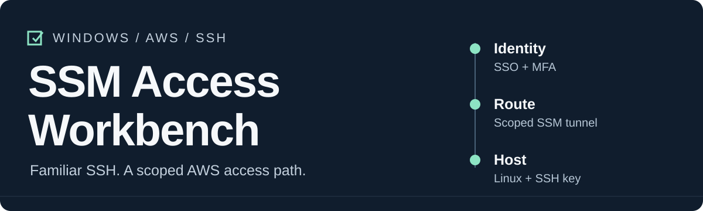
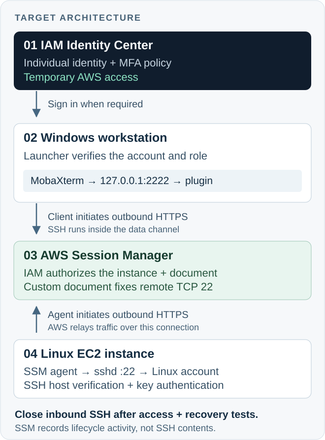

<div align="center">



# SSM Access Workbench

[](https://github.com/JadenRazo/ssm-access-workbench/actions/workflows/verify.yml)

**Keep MobaXterm. Put AWS identity in front of the connection.**

Interactive PowerShell tools and an AWS console guide for SSH access to a Linux EC2 instance through IAM Identity Center and Session Manager.

[Start the lab](docs/aws-console-setup.md) · [Set up Windows](docs/windows-setup.md) · [Understand the design](docs/architecture.md) · [Read the case study](docs/case-study.md)

</div>

---

## The problem

A Windows operator has a private SSH key, a saved MobaXterm session, and an EC2 security group that permits direct SSH. It is convenient, but the key and network path can outlive the operator's AWS access. Moving the connection behind Session Manager adds an AWS authorization decision while preserving the terminal and SFTP workflow.

This project packages that migration into something another operator can repeat: a console walkthrough, narrowly scoped policy templates, interactive workstation setup, and a launcher that refuses the wrong AWS account or role.

**The target design closes inbound TCP 22 after testing recovery.** Creating a tunnel alone does not remove the old route. SSH still authenticates a Linux account with its own key, and Session Manager does not record the contents of the SSH session. [AWS SSH documentation](https://docs.aws.amazon.com/systems-manager/latest/userguide/session-manager-getting-started-enable-ssh-connections.html)

## The access path

<p align="center">
  
</p>

1. **Identify the operator.** Identity Center issues temporary AWS access after the organization's sign-in policy is satisfied.
2. **Authorize the route.** IAM permits one instance and one administrator-owned Session document. That document fixes the destination to port 22.
3. **Authenticate on Linux.** MobaXterm connects to `127.0.0.1:2222`; sshd checks the SSH key and Linux account.

The local identity check prevents configuration mistakes. The enforceable controls are IAM, the network, and sshd. [Trust boundaries and limitations →](docs/security-model.md)

## What is included

| Tool | Purpose | Changes |
| :--- | :--- | :--- |
| [`New-AccessPackage.ps1`](scripts/New-AccessPackage.ps1) | Collect deployment values; generate IAM policy and Session document JSON | New local files only |
| [`Initialize-Workbench.ps1`](scripts/Initialize-Workbench.ps1) | Run the AWS SSO wizard, verify the account and role, save workstation settings | New AWS CLI profile when requested; local configuration |
| [`Start-Workbench.ps1`](scripts/Start-Workbench.ps1) | Reuse valid credentials or offer browser sign-in, verify identity, open the tunnel | SSO cache as needed; an SSM session |
| [`Test-Workbench.ps1`](scripts/Test-Workbench.ps1) | Check tools, SSO profile, caller identity, and local port | Read-only; no automatic login |
| [`New-WorkbenchShortcut.ps1`](scripts/New-WorkbenchShortcut.ps1) | Create a desktop launcher for this checkout | A Windows `.lnk` file |

The scripts ask for identifiers, never passwords, MFA codes, access keys, or private key contents. Existing toolkit configuration files and shortcuts are not overwritten; AWS CLI manages its own profile and SSO-session settings. AWS resources are configured in the console so each permission and dependency remains visible.

## Get started

**Supported workstation:** Windows with PowerShell **7.4+**, AWS CLI **v2**, the AWS Session Manager plugin, and MobaXterm. The reference target is Linux EC2 in the commercial `aws` partition. See the [installation and script-trust instructions](docs/windows-setup.md#1-install-the-workstation-tools).

Download or clone this repository into a permanent folder, inspect the scripts, then open **PowerShell 7** in that folder.

**Administrator — prepare the access path:**

```powershell
pwsh -NoProfile -File .\scripts\New-AccessPackage.ps1
```

Follow the [AWS console guide](docs/aws-console-setup.md) to create the Session document, permission set, group assignment, and instance prerequisites. The generated JSON is a review package; nothing is applied automatically.

**Operator — configure the workstation:**

```powershell
pwsh -NoProfile -File .\scripts\Initialize-Workbench.ps1
```

Save a MobaXterm session for `127.0.0.1`, port `2222` (or your agreed document port), your **Linux** username, and your protected SSH key. Verify the host fingerprint before accepting it. The [Windows guide](docs/windows-setup.md#3-save-the-mobaxterm-session) walks through the clicks.

**Everyday use:** double-click **SSM Access Workbench**, complete browser sign-in if needed, wait for the port-open message, and open the saved MobaXterm session. Keep the tunnel window open while working.

## Security decisions worth understanding

| Decision | What it achieves | What it does not establish |
| :--- | :--- | :--- |
| Identity Center with MFA | Centralized sign-in and temporary AWS credentials | A new MFA challenge for every SSH connection |
| One instance + one custom document | Restricts this role's Session Manager entry point | Restricts everything an authenticated shell can do |
| Close inbound SSH after verification | Removes the direct network route protected only by SSH authentication | Makes an exposed private key harmless on every network |
| Separate Linux authentication | Preserves SSH/SFTP and an OS authorization boundary | Automatically maps the SSO user to an individual Linux account |
| Session lifecycle audit | Records AWS control-plane activity | Records SSH commands or SFTP file contents |
| Account and role checks in the launcher | Catches wrong-profile and administrator-role mistakes | A security boundary against a user who can edit the script |

There is no single universal “enterprise standard.” This design fits teams that need existing SSH tooling and accept its audit tradeoff. A native SSM shell or a certificate-based access platform may be a better choice when keyless access, command recording, or just-in-time host credentials are requirements. [Decision record →](docs/decisions/001-access-pattern.md)

## Evidence, not a completion badge

The source lab established an Identity Center role and a custom Session Manager tunnel to an EC2 instance; the operator reported a successful MobaXterm connection. Policy validation returned no findings, and simulation covered the intended resource scope. Those checks do **not** prove the final production hardening state.

Automated tests exercise configuration validation, role checks, login failures, occupied ports, tunnel arguments, file preservation, and policy generation without AWS credentials. Real-cloud authorization, session termination, Windows desktop behavior, and host hardening have separate acceptance checks. [Verification ledger and test matrix →](docs/verification.md)

## Read the project

| If you want to… | Read |
| :--- | :--- |
| Reproduce the infrastructure through the console | [AWS setup](docs/aws-console-setup.md) |
| Onboard a Windows user and create shortcuts | [Windows setup](docs/windows-setup.md) |
| Understand the architecture and alternatives | [Architecture](docs/architecture.md) · [Decision record](docs/decisions/001-access-pattern.md) |
| Inspect least privilege and its limits | [IAM policy](docs/iam-policy.md) · [Security model](docs/security-model.md) |
| Diagnose a failed connection | [Troubleshooting](docs/troubleshooting.md) |
| Remove access or recover safely | [Operations runbook](docs/operations.md) |
| Understand what happened and practice explaining it | [Case study](docs/case-study.md) · [Interview preparation](docs/interview-prep.md) |
| Contribute or verify a change | [Contributing](CONTRIBUTING.md) · [Verification](docs/verification.md) |

## Run the checks

```powershell
pwsh -NoProfile -File .\tests\Run-Tests.ps1
python .\tests\check_repository.py
```

No AWS account or test framework installation is required. GitHub Actions runs the same checks on Windows and Linux. The [test scope](docs/verification.md#automated-checks) explains what is mocked and what is executed for real.

Built by [Jaden Razo](https://github.com/JadenRazo). Code and original documentation are [MIT licensed](LICENSE). AWS and MobaXterm are third-party products; this project is independent and is not an AWS or Mobatek certification.
