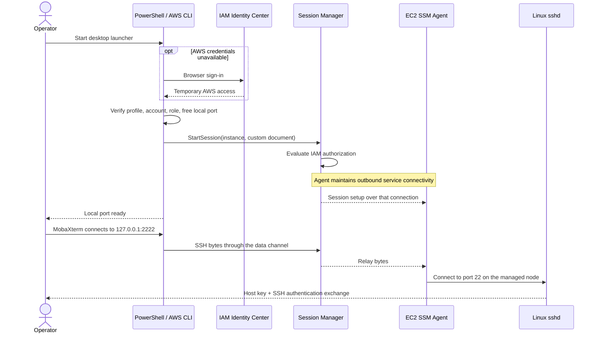

# Architecture

[← Project overview](../README.md)

The operator keeps an SSH client. AWS becomes the gate for establishing the network path, and Linux remains responsible for authenticating and authorizing the shell.

## Components and ownership

| Component | Owner | Responsibility |
| :--- | :--- | :--- |
| Identity Center user, group, MFA policy | Identity administrator | Establish the human identity and assign access |
| Permission set | Access administrator | Permit the approved Session Manager actions |
| Custom Session document | Infrastructure administrator | Fix the SSH destination and local listener port |
| EC2 role and SSM agent | Infrastructure administrator | Register the managed node and carry the session |
| AWS CLI and Session Manager plugin | Workstation operator | Authenticate, request the session, and open a local listener |
| MobaXterm and SSH key | Workstation operator | Verify the host and authenticate the Linux account |
| sshd, authorized keys, sudo, OS logging | Host administrator | Enforce and observe host access |

## Connection sequence

The agent and client initiate outbound connections to AWS. The diagram's AWS-to-agent messages travel over that established connection; they do not require an inbound security-group rule. The inner SSH transport remains encrypted. [AWS connection model](https://docs.aws.amazon.com/systems-manager/latest/userguide/session-manager-getting-started-enable-ssh-connections.html)

## Three independent lifetimes

| Lifetime | Governs | Operator implication |
| :--- | :--- | :--- |
| Identity Center sign-in session | How long the identity provider's sign-in remains usable | The browser may not ask for MFA again while it remains valid |
| Permission-set role credentials | How long an issued AWS role session is valid | A cached SSO session may obtain new role credentials |
| SSM tunnel and SSH connection | How long the transport and shell remain connected | Do not assume SSO sign-out or credential expiry immediately closes an established tunnel |

Choose durations deliberately, verify the behavior of the custom `Port` document, and explicitly terminate active sessions when removing access. [Identity Center authentication sessions](https://docs.aws.amazon.com/singlesignon/latest/userguide/authconcept.html) · [Permission-set duration](https://docs.aws.amazon.com/singlesignon/latest/userguide/howtosessionduration.html)

## Why two authentication systems?

AWS authorizes a route to the managed node. SSH verifies the server and authenticates a Linux user on that route. A private key alone cannot create a new SSM tunnel, but it may still work through another reachable SSH path or an already-open local tunnel. Closing direct SSH is therefore a migration step, not a side effect of installing the launcher.

The reference design uses a fixed local port for predictable MobaXterm bookmarks. For several hosts, allocate a distinct local port and custom document to each connection, then use separate configuration paths and shortcut names. Reusing `127.0.0.1:2222` for different hosts also causes SSH host-key collisions; investigate those warnings rather than suppressing them.

See [the security model](security-model.md) for endpoint compromise, credential exposure, host privileges, and audit limitations.
